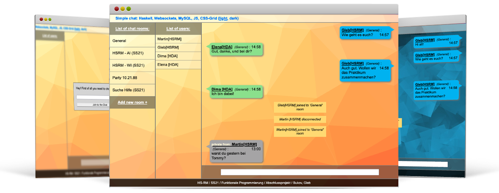

  

# Simple chat: Haskell, Websockets, MySQL, JS, CSS-Grid

Hello! I'm glad to introduce you my final project at *Funktionale Programmierung*. It is a very small, light version of a real-time chat. I did my best to involve all the techniques, i've learned technologies I've learned during this course.

**Functionality:**

+ choose the Name (duplicate names are not allowed)
+ Create unlimited number of rooms
+ Switch in between the rooms in one click or per command (@room)
+ All messages are saved in MySQL
+ As well as the Private Massages (different room)
+ Private messages are temporary (аre not saved in the database)
+ Two different themes (light, dark)

--  
**Gleb Bukov**  
HSRM SS2021
